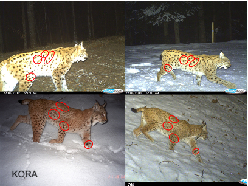

```{r setup, include=FALSE, echo=FALSE, cache = FALSE}
options(htmltools.dir.version = FALSE)
knitr::opts_chunk$set(comment = "")
library(tidyverse)
theme_set(theme_light())
update_geom_defaults("point", list(size = 2)) 
library(here)
library(nimble)
library(MCMCvis)
```

# A simple survival example

--

+ Say we release $n$ animals at the beginning of the winter, out of which $z$ survive, and we'd like to estimate winter survival $\theta$. 
```{r}
z <- 19 # nb of success
n <- 57 # nb of attempts
```

--

+ We have $z$ survivors out of $n$ released animals with winter survival probability $\phi$

???

+ Let's think of a simple survival example. 
+ We have z survivors out of n released individuals, which survived with probability phi. 

---

+ Our model:

\begin{align*}
   z &\sim \text{Binomial}(n, \phi) &\text{[likelihood]}
   \\
  \phi &\sim \text{Beta}(1, 1) &\text{[prior for }\phi \text{]} \\ 
\end{align*}

???

+ Our model so far has been a combination
+ Of a binomial likelihood
+ And a Beta prior with param 1 and 1, which is a uniform between 0 and 1. 

--

+ This is also:

\begin{align*}
   z_i &\sim \text{Bernoulli}(\phi), \; i = 1, \ldots, N &\text{[likelihood]}
   \\
  \phi &\sim \text{Beta}(1, 1) &\text{[prior for }\phi \text{]} \\ 
\end{align*}

???

+ The binomial is just a sum of Bernoulli outcomes
+ Like flipping a coin for each individual and get a survivor with prob phi. 


---
## Code and data

```{r}
naive.survival.model <- nimbleCode({
  # prior
  phi ~ dunif(0, 1)
  # likelihood
  y ~ dbinom(phi, n)
})
```

```{r}
my.data <- list(n = 57, y = 19)
```


---
## Distinguish constants and data

To Nimble, not all "data" is data...
```{r}
my.constants <- list(n = 57)
my.data <- list(y = 19)
```

--

**Constants**:
+ Can never be changed 
+ Must be provided when a model is defined (part of the model structure)
+ E.g. vector of known index values, variables used to define for-loops, etc. 

---
## Distinguish constants and data

To Nimble, not all "data" is data...
```{r}
my.constants <- list(n = 57)
my.data <- list(y = 19)
```

**Data**:
+ Can be changed without re-building the model 
+ Can be (re-)simulated within a model
+ E.g. stuff that *only* appears to the left of a "~" 

--

For computational efficiency, better to specify as much as possible as constants.

--

Nimble will help you with this!

---
## Specify initial values

```{r}
initial.values <- function() list(phi = runif(1,0,1))
```

--

```{r}
initial.values()
```


---
## Which parameters to save?

```{r}
parameters.to.save <- c("phi")
```

---
## MCMC details

```{r}
n.iter <- 5000
n.burnin <- 1000
n.chains <- 2
n.thin <- 1
```

--

Number of posterior samples per chain: 

$$n.posterior = \frac{n.iter - n.burnin}{n.thin}$$


---
## Run model, tadaa!

```{r, warning=FALSE, message=FALSE, eval = FALSE}
mcmc.output <- nimbleMCMC(code = naive.survival.model,     
                          data = my.data,  
                          constants = my.constants,
                          inits = initial.values,
                          monitors = parameters.to.save,
                          thin = n.thin,
                          niter = n.iter, 
                          nburnin = n.burnin, 
                          nchains = n.chains)
```

```{r, cache = TRUE, echo = FALSE, warning=FALSE, message=FALSE}
mcmc.output <- nimbleMCMC(code = naive.survival.model,     
                          data = my.data,              
                          constants = my.constants,
                          inits = initial.values,
                          monitors = parameters.to.save,
                          niter = n.iter, 
                          nburnin = n.burnin, 
                          nchains = n.chains,
                          progressBar = FALSE)
```


---
## Explore MCMC outputs

```{r}
str(mcmc.output)
```


---
## Explore MCMC outputs

```{r}
head(mcmc.output$chain1)
```

---
## Explore MCMC outputs

.center.nogap[
```{r, echo = FALSE, fig.width = 7.5, fig.asp = 0.618, dev = "svg", message=FALSE, warning=FALSE}
mcmc.output %>%
  as_tibble() %>%
  janitor::clean_names() %>%
  ggplot() + 
  geom_histogram(aes(x = chain1[,"phi"]), color = "white") + 
  labs(x = "survival probability")
```
]

---
## Numerical summaries

```{r}
library(MCMCvis)
MCMCsummary(mcmc.output, round = 2)
```

---
## Trace and posterior density

.pull-left[

```{r eval = FALSE}
MCMCtrace(mcmc.output,
          pdf = FALSE) 
```
]

--

.pull-right[

.center.nogap[
```{r, echo = FALSE, fig.width = 7.5, fig.asp = 0.618, dev = "svg", message=FALSE, warning=FALSE}
MCMCtrace(mcmc.output,
          pdf = FALSE) 
```
]
]


---
## Trace and posterior density

.pull-left[

```{r eval = FALSE}
MCMCtrace(mcmc.output,
          pdf = FALSE,
          ind = TRUE,
          Rhat = TRUE,
          n.eff = TRUE) 
```
]

--

.pull-right[

.center.nogap[
```{r, echo = FALSE, fig.width = 7.5, fig.asp = 0.618, dev = "svg", message=FALSE, warning=FALSE}
MCMCtrace(mcmc.output,
          pdf = FALSE,
          ind = TRUE,
          Rhat = TRUE,
          n.eff = TRUE) 
```
]
]

---

class: middle, center

## What if we had several winters? Say $T = 5$ winters.

???

+ In this design, we have a single winter. 
But for many species, we'll need to collect data on the long term to get a representative estimate of survival. 
+ Therefore what if we had say big T five winters? 

---
# Longitudinal data

+ $z_{i,t} = 1$ if individual $i$ alive at winter $t$, and $z_{i,t} = 2$ if dead.


.center.nogap[
```{r echo = FALSE, message=FALSE, warning=FALSE}
library(tidyverse)
nind <- 57
nocc <- 5
first <- rep(1, nind) # single cohort
z <- matrix(NA, nrow = nind, ncol = nocc)
phi <- 0.8
for (i in 1:nind){
  z[i,first[i]] <- 1
  for (t in (first[i]+1):nocc){
    z[i,t] <- rbinom(1, 1, phi * z[i,t-1]) # once you're dead z = 0, you remain dead
  }
}
z[z==0] <- 2 # 2 = dead, 1 = alive
colnames(z) <- paste0("winter ", 1:nocc)
z %>% 
  as_tibble() %>% 
  add_column(id = 1:nind, .before = "winter 1") %>%
  kableExtra::kable() %>%
  kableExtra::scroll_box(width = "100%", height = "400px")
#  kableExtra::kable_styling(font_size = 8, 
#                            latex_options = "scale_down")
```
]

???

+ This is what we call longitudinal data. 
+ Each row is an individual i, and columns are for winters t, or sampling occasions. 
+ z is indexed by both i and t, and takes value 1 if ind i is alive in winter t, and 2 otherwise. 

---
# A model for longitudinal survival data

--

+ Let's think of a model for these data. The objective remains the same, estimating survival. To build this model, we'll make assumptions. 

--

+ The state of an animal at a given winter, alive or dead, is only dependent on its state the winter before. 

???

+ First, we assume that the state of an animal in a given winter, alive or dead, is only dependent on its state the winter before. 

--

+ The future depends only on the present, not the past: **Markov process**.

???

+ In others words, he future depends only on the present, not the past
+ This is a Markov process.

--

+ If an animal is alive in a given winter, the probability it survives to the next winter is $\phi$. 

???

+ If an animal is alive in a given winter, the probability it survives to the next winter is $\phi$. 

--

+ The probability it dies is $1 - \phi$.

???

+ The probability it dies is $1 - \phi$.

--

+ If an animal is dead a winter, it remains dead, unless you believe in zombies. 

???

+ If an animal is dead a winter, it remains dead, unless you believe in zombies.

---
# Transition matrix

--

+ The core of the Markov process is made of the transition probabilities.

???

+ The engine of a Markov model is the transition matrix. 
+ This matrix or table gathers the probabilities of transition between states from one occasion to the next. 

--

+ For example, the probability of transitioning from state alive at $t-1$ to state alive at $t$ is $\Pr(z_t = 1 | z_{t-1} = 1) = \gamma_{1,1}$. It is the survival probability $\phi$. 

???

+ For example, the probability of transitioning from state alive at $t-1$ to state alive at $t$ is $\Pr(z_t = 1 | z_{t-1} = 1) = \gamma_{1,1}$. It is the survival probability $\phi$. 


--

+ The probability of dying over the interval $(t-1, t)$ is $\Pr(z_t = 2 | z_{t-1} = 1) = \gamma_{1,2} = 1 - \phi$.

???

+ The probability of dying over the interval $(t-1, t)$ is $\Pr(z_t = 2 | z_{t-1} = 1) = \gamma_{1,2} = 1 - \phi$.

--

+ Now if an animal is dead at $t-1$, then $\Pr(z_t = 1 | z_{t-1} = 2) = 0$ and $\Pr(z_t = 2 | z_{t-1} = 2) = 1$.

???

+ Now if an animal is dead at $t-1$, then $\Pr(z_t = 1 | z_{t-1} = 2) = 0$ and $\Pr(z_t = 2 | z_{t-1} = 2) = 1$.


--

+ These probabilities can be packed in a transition matrix $\mathbf{\Gamma}$:

\begin{align*}
\mathbf{\Gamma} = 
\left(\begin{array}{cc} 
\gamma_{1,1} & \gamma_{1,2}\\ 
\gamma_{2,1} & \gamma_{2,2}
\end{array}\right) =
\left(\begin{array}{cc} 
\phi & 1 - \phi\\ 
0 & 1
\end{array}\right)
\end{align*}

???

+ These probabilities can be packed in a transition matrix $\mathbf{\Gamma}$:

---
class: middle, center

Transition matrix:

$$
\begin{matrix}
& \\
\mathbf{\Gamma} = 
    \left ( \vphantom{ \begin{matrix} 12 \\ 12 \end{matrix} } \right .
\end{matrix}
\hspace{-1.2em}
\begin{matrix}
    z_t=A & z_t=D \\ \hdashline
\phi & 1-\phi \\
0 & 1
\end{matrix}
\hspace{-0.2em}
\begin{matrix}
& \\
\left . \vphantom{ \begin{matrix} 12 \\ 12 \end{matrix} } \right )
    \begin{matrix}
    z_{t-1}=A \\ z_{t-1}=D
    \end{matrix}
\end{matrix}
$$
???

+ Take some time to navigate through this matrix. 
+ From in rows, the origin, to in columns, the destination. 
+ For example...

---
# Initial states

--

+ A Markov process has to start somewhere. 

???

+ A Markov process has to start somewhere. 

--

+ We need the probabilities of initial states, i.e. states at $t = 1$. 

???

+ In other words, we need the probabilities of initial states
+ i.e. states at $t = 1$. 


--

+ We will use $\mathbf{\delta} = \left(\Pr(z_1 = 1), \Pr(z_1 = 2)\right)$.

???

+ We will denote delta this vector. 
+ It gathers the probability of being in each initial states.
+ Here alive 1 and dead 2.

--

+ Here we assume that all animals are alive at first winter, i.e. $\Pr(z_1 = 1) = 1$ and $\Pr(z_1 = 2) = 0$. 

???

+ All individuals are marked and release in first winter.
+ Therefore alive when first captured.
+ Which means that they are all in state 1 alive for sure. 

---
# Likelihood 

\begin{align*}
\Pr(\mathbf{z}) &= \Pr(z_T, z_{T-1}, z_{T-2}, \ldots, z_1) \color{white}{\Pr(z_{T-1}, z_{T-2},\ldots, z_1) \Pr(z_{T-2}, \ldots, z_1)} \\
\end{align*}

???

+ OK now that we've defined a Markov model, we need its likelihood to apply the Bayes theorem. 
+ The likelihood is the probability of the data, given the model. Here the data are the z. 

---
# Likelihood 

\begin{align*}
\Pr(\mathbf{z}) &= \Pr(z_T, z_{T-1}, z_{T-2}, \ldots, z_1) \color{white}{\Pr(z_{T-1}, z_{T-2},\ldots, z_1) \Pr(z_{T-2}, \ldots, z_1)}\\
                &= \Pr(z_T | z_{T-1}, z_{T-2},\ldots, z_1) \Pr(z_{T-1}, z_{T-2},\ldots, z_1) \\
\end{align*}

???

+ We're gonna work backward, starting from the last sampling occasion. 
+ Now the likelihood can be written as the product of the probability of zT ie you're alive or not on the last occasion given your past history, that is the states at previous occasions, times the prob of your past history, y definition of cond prob. 

---
# Likelihood 

\begin{align*}
\Pr(\mathbf{z}) &= \Pr(z_T, z_{T-1}, z_{T-2}, \ldots, z_1) \color{white}{\Pr(z_{T-1}, z_{T-2},\ldots, z_1) \Pr(z_{T-2}, \ldots, z_1)}\\
                &= \Pr(z_T | z_{T-1}, z_{T-2},\ldots, z_1) \Pr(z_{T-1}, z_{T-2},\ldots, z_1) \\
                &= \Pr(z_T | z_{T-1}) \Pr(z_{T-1}, z_{T-2},\ldots, z_1) \\
\end{align*}

???

+ Then because we have a Markov model, we're memory less, that is prob of next state, here zT, depends only on the current state, that is zT-1, and not the previous states. 

---
# Likelihood 

\begin{align*}
\Pr(\mathbf{z}) &= \Pr(z_T, z_{T-1}, z_{T-2}, \ldots, z_1) \color{white}{\Pr(z_{T-1}, z_{T-2},\ldots, z_1) \Pr(z_{T-2}, \ldots, z_1)}\\
                &= \Pr(z_T | z_{T-1}, z_{T-2},\ldots, z_1) \Pr(z_{T-1}, z_{T-2},\ldots, z_1) \\
                &= \Pr(z_T | z_{T-1}) \Pr(z_{T-1}, z_{T-2},\ldots, z_1) \\
                &= \Pr(z_T | z_{T-1}) \Pr(z_{T-1} | z_{T-2}, \ldots, z_1) \Pr(z_{T-2}, \ldots, z_1)\\
\end{align*}

???

+ You can apply the same reasoning to T-1. 
+ First conditional prob.

---
# Likelihood 

\begin{align*}
\Pr(\mathbf{z}) &= \Pr(z_T, z_{T-1}, z_{T-2}, \ldots, z_1) \color{white}{\Pr(z_{T-1}, z_{T-2},\ldots, z_1) \Pr(z_{T-2}, \ldots, z_1)}\\
                &= \Pr(z_T | z_{T-1}, z_{T-2},\ldots, z_1) \Pr(z_{T-1}, z_{T-2},\ldots, z_1) \\
                &= \Pr(z_T | z_{T-1}) \Pr(z_{T-1}, z_{T-2},\ldots, z_1) \\
                &= \Pr(z_T | z_{T-1}) \Pr(z_{T-1} | z_{T-2}, \ldots, z_1) \Pr(z_{T-2}, \ldots, z_1)\\
                &= \Pr(z_T | z_{T-1}) \Pr(z_{T-1} | z_{T-2}) \Pr(z_{T-2}, \ldots, z_1)\\
\end{align*}

???

+ Then markovian property.

---
# Likelihood 

\begin{align*}
\Pr(\mathbf{z}) &= \Pr(z_T, z_{T-1}, z_{T-2}, \ldots, z_1) \color{white}{\Pr(z_{T-1}, z_{T-2},\ldots, z_1) \Pr(z_{T-2}, \ldots, z_1)}\\
                &= \Pr(z_T | z_{T-1}, z_{T-2},\ldots, z_1) \Pr(z_{T-1}, z_{T-2},\ldots, z_1) \\
                &= \Pr(z_T | z_{T-1}) \Pr(z_{T-1}, z_{T-2},\ldots, z_1) \\
                &= \Pr(z_T | z_{T-1}) \Pr(z_{T-1} | z_{T-2}, \ldots, z_1) \Pr(z_{T-2}, \ldots, z_1)\\
                &= \Pr(z_T | z_{T-1}) \Pr(z_{T-1} | z_{T-2}) \Pr(z_{T-2}, \ldots, z_1)\\
                &= \ldots \\
\end{align*}

???

+ And so on.

---
# Likelihood 

\begin{align*}
\Pr(\mathbf{z}) &= \Pr(z_T, z_{T-1}, z_{T-2}, \ldots, z_1) \color{white}{\Pr(z_{T-1}, z_{T-2},\ldots, z_1) \Pr(z_{T-2}, \ldots, z_1)}\\
                &= \Pr(z_T | z_{T-1}, z_{T-2},\ldots, z_1) \Pr(z_{T-1}, z_{T-2},\ldots, z_1) \\
                &= \Pr(z_T | z_{T-1}) \Pr(z_{T-1}, z_{T-2},\ldots, z_1) \\
                &= \Pr(z_T | z_{T-1}) \Pr(z_{T-1} | z_{T-2}, \ldots, z_1) \Pr(z_{T-2}, \ldots, z_1)\\
                &= \Pr(z_T | z_{T-1}) \Pr(z_{T-1} | z_{T-2}) \Pr(z_{T-2}, \ldots, z_1)\\
                &= \ldots \\
                &= \Pr(z_T | z_{T-1}) \Pr(z_{T-1} | z_{T-2}) \ldots \Pr(z_{2} | z_{1}) \Pr(z_{1})\\
\end{align*}

???

+ You end up with this expression for the likelihood. 


---
# Likelihood 

\begin{align*}
\Pr(\mathbf{z}) &= \Pr(z_T, z_{T-1}, z_{T-2}, \ldots, z_1) \color{white}{\Pr(z_{T-1}, z_{T-2},\ldots, z_1) \Pr(z_{T-2}, \ldots, z_1)}\\
                &= \Pr(z_T | z_{T-1}, z_{T-2},\ldots, z_1) \Pr(z_{T-1}, z_{T-2},\ldots, z_1) \\
                &= \Pr(z_T | z_{T-1}) \Pr(z_{T-1}, z_{T-2},\ldots, z_1) \\
                &= \Pr(z_T | z_{T-1}) \Pr(z_{T-1} | z_{T-2}, \ldots, z_1) \Pr(z_{T-2}, \ldots, z_1)\\
                &= \Pr(z_T | z_{T-1}) \Pr(z_{T-1} | z_{T-2}) \Pr(z_{T-2}, \ldots, z_1)\\
                &= \ldots \\
                &= \Pr(z_T | z_{T-1}) \Pr(z_{T-1} | z_{T-2}) \ldots \Pr(z_{2} | z_{1}) \Pr(z_{1})\\
                &= \Pr(z_{1}) \prod_{t=2}^T{\Pr(z_{t} | z_{t-1})}\\
\end{align*}

???

+ A product of cond probabilities. And the prob of initial states Pr(z1). 


---
# Likelihood 

\begin{align*}
\Pr(\mathbf{z}) &= \Pr(z_T, z_{T-1}, z_{T-2}, \ldots, z_1) \color{white}{\Pr(z_{T-1}, z_{T-2},\ldots, z_1) \Pr(z_{T-2}, \ldots, z_1)}\\
                &= \Pr(z_T | z_{T-1}, z_{T-2},\ldots, z_1) \Pr(z_{T-1}, z_{T-2},\ldots, z_1) \\
                &= \Pr(z_T | z_{T-1}) \Pr(z_{T-1}, z_{T-2},\ldots, z_1) \\
                &= \Pr(z_T | z_{T-1}) \Pr(z_{T-1} | z_{T-2}, \ldots, z_1) \Pr(z_{T-2}, \ldots, z_1)\\
                &= \Pr(z_T | z_{T-1}) \Pr(z_{T-1} | z_{T-2}) \Pr(z_{T-2}, \ldots, z_1)\\
                &= \ldots \\
                &= \Pr(z_T | z_{T-1}) \Pr(z_{T-1} | z_{T-2}) \ldots \Pr(z_{2} | z_{1}) \Pr(z_{1})\\
                &= \Pr(z_{1}) \prod_{t=2}^T{\Pr(z_{t} | z_{t-1})}\\
                &= \Pr(z_{1}) \prod_{t=2}^T{\gamma_{z_{t-1},z_{t}}}\\
\end{align*}

???

+ We recognize the gammas we defined earlier. 
+ The transition probabilities. 


<!-- --- -->
<!-- # Matrix formulation of the likelihood -->

<!-- \begin{align*} -->
<!-- \Pr(\mathbf{z}) &= \Pr(z_T, z_{T-1}, z_{T-2}, \ldots, z_1) \color{white}{\Pr(z_{T-1}, z_{T-2},\ldots, z_1) \Pr(z_{T-2}, \ldots, z_1)}\\ -->
<!--                 &= \Pr(z_{1}) \prod_{t=2}^T{\gamma_{z_{t-1},z_{t}}}\\ -->
<!--                 &= \mathbf{\delta} \; \mathbf{\Gamma} \cdots \mathbf{\Gamma} -->
<!-- \end{align*} -->

---
# Example

+ Let's assume an animal is alive, alive then dies. 

???

+ I realise these calculations are a bit difficult to follow. 
+ Let's take an example. 

--

+ We have $\mathbf{z} = (1, 1, 2)$. What is the contribution of this animal to the likelihood?

???

+ We have $\mathbf{z} = (1, 1, 2)$. What is the contribution of this animal to the likelihood?
+ Let's apply the formula we have just derived. 

--

\begin{align*}
\Pr(\mathbf{z} = (1, 1, 2)) &= \Pr(z_1 = 1) \; \gamma_{z_{1} = 1, z_{2} = 1} \; \gamma_{z_{2} = 1, z_{3} = 2}\\
                            &= 1 \; \phi \; (1 - \phi).
\end{align*}

???

+ The prob of having the sequence alive, alive and dead is
+ The prob of being alive first, the to stay alive, then to die. 
+ The prob of being alive at first occasion being 1, we have that the contribution of this individual to the likelihood is phi times 1 - phi. 

--

+ Remember: 

\begin{align*}
\mathbf{\Gamma} = 
\left(\begin{array}{cc} 
\gamma_{1,1} & \gamma_{1,2}\\ 
\gamma_{2,1} & \gamma_{2,2}
\end{array}\right) =
\left(\begin{array}{cc} 
\phi & 1 - \phi\\ 
0 & 1
\end{array}\right)
\end{align*}


---
# Our model

\begin{align*}
   z_1 &\sim \text{Multinomial}(1, \delta) &\text{[likelihood, }t = 1 \text{]}\\
   \color{white}{z_t | z_{t-1}} & \color{white}{\sim} \color{white}{\text{Multinomial}(1, \gamma_{z_{t-1},z_{t}})} & \color{white}{\text{[likelihood, }t > 1 \text{]}}\\
  \color{white}{\phi} & \color{white}{\sim} \color{white}{\text{Beta}(1, 1)} & \color{white}{\text{[prior for }\phi \text{]}} \\ 
\end{align*}

???

+ OK let's wrap it up. 
+ Our model so far is that one. 

+ Initial state is multinomial with one trial, and probability delta. 
+ That is you have a dice with two faces, a coin, and you have some prob to be alive, and 1 - that prob to be dead. + Of course, it you want your Markov chain to start, you'd better say it's alive so that delta is just (1,0). 

---
# Our model

\begin{align*}
   z_1 &\sim \text{Multinomial}(1, \delta) &\text{[likelihood, }t = 1 \text{]}\\
   \color{white}{z_t | z_{t-1}} & \color{white}{\sim} \color{white}{\text{Multinomial}(1, \gamma_{z_{t-1},z_{t}})} & \color{white}{\text{[likelihood, }t > 1 \text{]}}\\
  \phi &\sim \text{Beta}(1, 1) &\text{[prior for }\phi \text{]} \\ 
\end{align*}

???

+ We also need a prior on survival.
+ As usual we take a uniform distribution between 0 and 1, or a beta with parameters 1 and 1.

---
# Our model

\begin{align*}
   z_1 &\sim \text{Multinomial}(1, \delta) &\text{[likelihood, }t = 1 \text{]}\\
   z_t | z_{t-1} &\sim \text{Multinomial}(1, \gamma_{z_{t-1},z_{t}}) &\text{[likelihood, }t > 1 \text{]}\\
  \phi &\sim \text{Beta}(1, 1) &\text{[prior for }\phi \text{]} \\ 
\end{align*}


???

+ Now the main part is the dynamic of the states.
+ Our state at t depends only on your state at t-1, and it is a multinomial random variable, with one trial. 
+ And the probabilities are given by the rows of the transition matrix.


---
# Our model

\begin{align*}
   z_1 &\sim \text{Multinomial}(1, \delta) &\text{[likelihood, }t = 1 \text{]}\\
   z_t | z_{t-1} &\sim \text{Multinomial}(1, \gamma_{z_{t-1},z_{t}}) &\text{[likelihood, }t > 1 \text{]}\\
  \phi &\sim \text{Beta}(1, 1) &\text{[prior for }\phi \text{]} \\ 
\end{align*}

\begin{align*}
\mathbf{\Gamma} = 
\left(\begin{array}{cc} 
\color{blue}{\phi} & \color{blue}{1 - \phi}\\ 
0 & 1
\end{array}\right)
\end{align*}

$$\color{blue}{\gamma_{z_{t-1} = 1,z_{t}} = (\phi, 1-\phi)}$$


???

+ If z at t-1 is alive, it is the first row, that is phi and 1-phi. 

---
# Our model

\begin{align*}
   z_1 &\sim \text{Multinomial}(1, \delta) &\text{[likelihood, }t = 1 \text{]}\\
   z_t | z_{t-1} &\sim \text{Multinomial}(1, \gamma_{z_{t-1},z_{t}}) &\text{[likelihood, }t > 1 \text{]}\\
  \phi &\sim \text{Beta}(1, 1) &\text{[prior for }\phi \text{]} \\ 
\end{align*}

\begin{align*}
\mathbf{\Gamma} = 
\left(\begin{array}{cc} 
\phi & 1 - \phi\\ 
\color{blue}{0} & \color{blue}{1}
\end{array}\right)
\end{align*}

$$\color{blue}{\gamma_{z_{t-1} = 2,z_{t}} = (0, 1)}$$

???

+ Otherwise, if z at t-1 is dead that is 2, then it is the second row of gamma, 0 and 1. 
+ If dead you remain dead. 

---
# Nimble implementation

+ In Nimble, we will use the categorical distribution `dcat()`.

+ The categorical distribution is a multinomial distribution with a single draw. 

???

+ In Nimble, we will use the categorical distribution `dcat()`.

+ The categorical distribution is a multinomial distribution with a single draw. 


--

.tiny-font[
```{r}
nimble::rcat(n = 20, prob = c(0.1, 0.3, 0.6))
```
]

--

.tiny-font[
```{r}
nimble::rcat(n = 20, prob = c(0.1, 0.1, 0.4, 0.2, 0.2))
```
]


???


https://en.wikipedia.org/wiki/Categorical_distribution

The categorical distribution is the generalization of the Bernoulli distribution for a categorical random variable, i.e. for a discrete variable with more than two possible outcomes, such as the roll of a dice. On the other hand, the categorical distribution is a special case of the multinomial distribution, in that it gives the probabilities of potential outcomes of a single drawing rather than multiple drawings. 

---
### Nimble code
```{r echo = FALSE, warning=FALSE, message=FALSE}
library(nimble)
```
.small-font[
```{r}
markov.survival <- nimbleCode({
  phi ~ dunif(0, 1) # prior
  gamma[1,1] <- phi      # Pr(alive t -> alive t+1)
  gamma[1,2] <- 1 - phi  # Pr(alive t -> dead t+1)
  gamma[2,1] <- 0        # Pr(dead t -> alive t+1)
  gamma[2,2] <- 1        # Pr(dead t -> dead t+1)
  delta[1] <- 1          # Pr(alive t = 1) = 1
  delta[2] <- 0          # Pr(dead t = 1) = 0
  # likelihood
  for (i in 1:N){
    z[i,1] ~ dcat(delta[1:2])
    for (j in 2:T){
      z[i,j] ~ dcat(gamma[z[i,j-1], 1:2])
    }
  }})
```
]


---
### Nimble code
```{r echo = FALSE, warning=FALSE, message=FALSE}
library(nimble)
```
.small-font[
```{r}
markov.survival <- nimbleCode({
  phi ~ dunif(0, 1) # prior #<<
  gamma[1,1] <- phi      # Pr(alive t -> alive t+1)
  gamma[1,2] <- 1 - phi  # Pr(alive t -> dead t+1)
  gamma[2,1] <- 0        # Pr(dead t -> alive t+1)
  gamma[2,2] <- 1        # Pr(dead t -> dead t+1)
  delta[1] <- 1          # Pr(alive t = 1) = 1
  delta[2] <- 0          # Pr(dead t = 1) = 0
  # likelihood
  for (i in 1:N){
    z[i,1] ~ dcat(delta[1:2])
    for (j in 2:T){
      z[i,j] ~ dcat(gamma[z[i,j-1], 1:2])
    }
  }})
```
]

---
### Nimble code
```{r echo = FALSE, warning=FALSE, message=FALSE}
library(nimble)
```
.small-font[
```{r}
markov.survival <- nimbleCode({
  phi ~ dunif(0, 1) # prior
  gamma[1,1] <- phi      # Pr(alive t -> alive t+1) #<<
  gamma[1,2] <- 1 - phi  # Pr(alive t -> dead t+1) #<<
  gamma[2,1] <- 0        # Pr(dead t -> alive t+1) #<<
  gamma[2,2] <- 1        # Pr(dead t -> dead t+1) #<<
  delta[1] <- 1          # Pr(alive t = 1) = 1
  delta[2] <- 0          # Pr(dead t = 1) = 0
  # likelihood
  for (i in 1:N){
    z[i,1] ~ dcat(delta[1:2])
    for (j in 2:T){
      z[i,j] ~ dcat(gamma[z[i,j-1], 1:2])
    }
  }})
```
]

---
### Nimble code
```{r echo = FALSE, warning=FALSE, message=FALSE}
library(nimble)
```
.small-font[
```{r}
markov.survival <- nimbleCode({
  phi ~ dunif(0, 1) # prior
  gamma[1,1] <- phi      # Pr(alive t -> alive t+1)
  gamma[1,2] <- 1 - phi  # Pr(alive t -> dead t+1)
  gamma[2,1] <- 0        # Pr(dead t -> alive t+1)
  gamma[2,2] <- 1        # Pr(dead t -> dead t+1)
  delta[1] <- 1          # Pr(alive t = 1) = 1 #<<
  delta[2] <- 0          # Pr(dead t = 1) = 0 #<<
  # likelihood
  for (i in 1:N){
    z[i,1] ~ dcat(delta[1:2])
    for (j in 2:T){
      z[i,j] ~ dcat(gamma[z[i,j-1], 1:2])
    }
  }})
```
]


---
### Nimble code
```{r echo = FALSE, warning=FALSE, message=FALSE}
library(nimble)
```
.small-font[
```{r}
markov.survival <- nimbleCode({
  phi ~ dunif(0, 1) # prior
  gamma[1,1] <- phi      # Pr(alive t -> alive t+1)
  gamma[1,2] <- 1 - phi  # Pr(alive t -> dead t+1)
  gamma[2,1] <- 0        # Pr(dead t -> alive t+1)
  gamma[2,2] <- 1        # Pr(dead t -> dead t+1)
  delta[1] <- 1          # Pr(alive t = 1) = 1
  delta[2] <- 0          # Pr(dead t = 1) = 0
  # likelihood
  for (i in 1:N){ #<<
    z[i,1] ~ dcat(delta[1:2]) 
    for (j in 2:T){
      z[i,j] ~ dcat(gamma[z[i,j-1], 1:2])
    } 
  } #<<
  })
```
]


---
### Nimble code
```{r echo = FALSE, warning=FALSE, message=FALSE}
library(nimble)
```
.small-font[
```{r}
markov.survival <- nimbleCode({
  phi ~ dunif(0, 1) # prior
  gamma[1,1] <- phi      # Pr(alive t -> alive t+1)
  gamma[1,2] <- 1 - phi  # Pr(alive t -> dead t+1)
  gamma[2,1] <- 0        # Pr(dead t -> alive t+1)
  gamma[2,2] <- 1        # Pr(dead t -> dead t+1)
  delta[1] <- 1          # Pr(alive t = 1) = 1
  delta[2] <- 0          # Pr(dead t = 1) = 0
  # likelihood
  for (i in 1:N){
    z[i,1] ~ dcat(delta[1:2]) #<<
    for (j in 2:T){
      z[i,j] ~ dcat(gamma[z[i,j-1], 1:2])
    }
  }})
```
]

---
### Nimble code
```{r echo = FALSE, warning=FALSE, message=FALSE}
library(nimble)
```
.small-font[
```{r}
markov.survival <- nimbleCode({
  phi ~ dunif(0, 1) # prior
  gamma[1,1] <- phi      # Pr(alive t -> alive t+1)
  gamma[1,2] <- 1 - phi  # Pr(alive t -> dead t+1)
  gamma[2,1] <- 0        # Pr(dead t -> alive t+1)
  gamma[2,2] <- 1        # Pr(dead t -> dead t+1)
  delta[1] <- 1          # Pr(alive t = 1) = 1
  delta[2] <- 0          # Pr(dead t = 1) = 0
  # likelihood
  for (i in 1:N){
    z[i,1] ~ dcat(delta[1:2])
    for (j in 2:T){ #<<
      z[i,j] ~ dcat(gamma[z[i,j-1], 1:2])
    } #<<
  }})
```
]


---
### Nimble code
```{r echo = FALSE, warning=FALSE, message=FALSE}
library(nimble)
```
.small-font[
```{r}
markov.survival <- nimbleCode({
  phi ~ dunif(0, 1) # prior
  gamma[1,1] <- phi      # Pr(alive t -> alive t+1)
  gamma[1,2] <- 1 - phi  # Pr(alive t -> dead t+1)
  gamma[2,1] <- 0        # Pr(dead t -> alive t+1)
  gamma[2,2] <- 1        # Pr(dead t -> dead t+1)
  delta[1] <- 1          # Pr(alive t = 1) = 1
  delta[2] <- 0          # Pr(dead t = 1) = 0
  # likelihood
  for (i in 1:N){
    z[i,1] ~ dcat(delta[1:2])
    for (j in 2:T){
      z[i,j] ~ dcat(gamma[z[i,j-1], 1:2]) #<<
    }
  }})
```
]

---
### Note

+ Vector $\delta$ is used as a placeholder for more complex models to come.

+ Here, you could write `z[i,1] <- 1`. 


---
### Nimble awesomness

You should be able to define vectors and matrices like you do in `R`.  

.small-font[
```{r, eval = FALSE}
markov.survival <- nimbleCode({
  phi ~ dunif(0, 1) # prior
  gamma[1:2,1:2] <- matrix( c(phi, 0, 1 - phi, 1), nrow = 2) #<<
  delta[1:2] <- c(1, 0) #<<
  # likelihood
  for (i in 1:N){
    z[i,1] ~ dcat(delta[1:2])
    for (j in 2:T){
      z[i,j] ~ dcat(gamma[z[i,j-1], 1:2])
    }
  }})
```
]

---
### Converting to Nimble from Jags, OpenBUGS or WinBUGS

+ Main difference is that Nimble does not guess. 

+ We need to specify dimensions of vectors and matrices. 

+ You cannot write `x[]` or `x[i,]`. Just provide index ranges `x[1:n]` or `x[i,1:m]`.

+ More tips [here](https://r-nimble.org/quick-guide-for-converting-from-jags-or-bugs-to-nimble).

---
## Constants and data

```{r}
my.constants <- list(N = 57, T = 5)
my.constants

my.data <- list(z = z)
```

---
## Initial values

```{r}
initial.values <- function() list(phi = runif(1,0,1))
initial.values()
```

---
## Parameters to monitor

```{r}
parameters.to.save <- c("phi")
parameters.to.save
```

---
## MCMC details

```{r}
n.iter <- 5000
n.burnin <- 1000
n.chains <- 2
```

---
## Run Nimble
```{r, message=FALSE, warning=FALSE, eval=FALSE}
mcmc.output <- nimbleMCMC(code = markov.survival, 
                          constants = my.constants,
                          data = my.data,              
                          inits = initial.values,
                          monitors = parameters.to.save,
                          niter = n.iter, 
                          nburnin = n.burnin, 
                          nchains = n.chains)
```

```{r, message=FALSE, warning=FALSE, eval=TRUE, echo = FALSE}
mcmc.output <- nimbleMCMC(code = markov.survival, 
                          constants = my.constants,
                          data = my.data,              
                          inits = initial.values,
                          monitors = parameters.to.save,
                          niter = n.iter, 
                          nburnin = n.burnin, 
                          nchains = n.chains,
                          progressBar = FALSE)
```

---
## Posterior distribution of survival

```{r}
library(MCMCvis)
MCMCsummary(mcmc.output, round = 2)
```

--

+ Posterior mean and median are close to $0.8$. 

--

+ Cool! The data was simulated, with (true) survival $\phi = 0.8$. 


---

class: middle, center

## Unfortunately, this is the data we wish we had. 

---
# In real life

--

+ Animals cannot be monitored exhaustively, like humans in a medical trial.

--

+ Animals are captured, marked or identified then released alive. 

--

+ Then, these animals may be detected again, or go undetected <span>&#8212;</span> **capture-recapture** 

--

+ Whenever animals go undetected, it might be that they were alive but missed, or because they were dead and therefore could not be detected <span>&#8212;</span> **imperfect detection**. 

--

+ The Markov process for survival is only partially observed <span>&#8212;</span> **hidden Markov models**.  

---
class: center, middle
background-image: url(img/satellite.png)
background-size: cover

---
# The truth is in $z$

.center.nogap[
```{r echo = FALSE}
z %>% 
  as_tibble() %>% 
  add_column(id = 1:nind, .before = "winter 1") %>%
  kableExtra::kable() %>%
  kableExtra::scroll_box(width = "100%", height = "300px")
```
]

--

+ Unfortunately, we have only partial access to $z$. 

--

+ We do observe $y$ the detections and non-detections.

--

+ How are $z$ and $y$ connected?  

---
## Dead animals go undetected

--

+ When an animal is dead i.e. $z = 2$, it cannot be detected, therefore $y = 0$. 

--

.center.nogap[
```{r echo = FALSE}
z %>% 
  as_tibble() %>% 
  replace(. == 2, 0) %>%
  add_column(id = 1:nind, .before = "winter 1") %>%
  kableExtra::kable() %>%
  kableExtra::scroll_box(width = "100%", height = "300px")
```
]

---
## Alive animals may be detected or not

+ If animal is alive $z = 1$, it is detected $y = 1$ w/ prob $p$ or not $y = 0$ w/ prob $1-p$. 

+ Before **first** detection, we know nothing, and we proceed conditional on it.

.center.nogap[
```{r echo = FALSE}
p <- 0.6
y <- z
y[z==2] <- 0
y[y==1] <- rbinom(n = sum(y==1), 1, p)
nobs <- sum(apply(y,1,sum) != 0)
y <- y[apply(y,1,sum) !=0, ]
first <- apply(y, 1, function(x) min(which(x !=0)))
for (i in 1:nobs){
  if(first[i] > 1) y[i, 1:(first[i]-1)] <- NA
}
y %>%
  as_tibble() %>%
  add_column(id = 1:nobs, .before = "winter 1") %>%
  kableExtra::kable() %>%
  kableExtra::scroll_box(width = "100%", height = "300px")
```
]

???

+ Compare with previous table
+ Some 1s have become 0s. 

--

+ This table $y$ is what we observe in real life.

???

+ To make the connection between the observations, the y, and the true states, the z
+ We need to describe how observations are made from the states

---
# Observation matrix

--

+ The observation probabilities can be packed in an observation matrix $\mathbf{\Omega}$.

--

+ In rows: the states alive $z = 1$ and dead $z = 2$.  

--

+ In columns: the observations non-detected $y = 1$ and detected $y = 2$ (previously coded 0 and 1 respectively). 

\begin{align*}
\mathbf{\Omega} = 
\left(\begin{array}{cc} 
\omega_{1,1} & \omega_{1,2}\\ 
\omega_{2,1} & \omega_{2,2}
\end{array}\right) =
\left(\begin{array}{cc} 
1 - p & p\\ 
1 & 0
\end{array}\right)
\end{align*}

--

Observation matrix:

$$
\begin{matrix}
& \\
\mathbf{\Omega} = 
    \left ( \vphantom{ \begin{matrix} 12 \\ 12 \end{matrix} } \right .
\end{matrix}
\hspace{-1.2em}
\begin{matrix}
    y_t=1 & y_t=2 \\ \hdashline
1 - p & p\\ 
1 & 0\\
\end{matrix}
\hspace{-0.2em}
\begin{matrix}
& \\
\left . \vphantom{ \begin{matrix} 12 \\ 12 \end{matrix} } \right )
    \begin{matrix}
    z_{t}=A \\ z_{t}=D
    \end{matrix}
\end{matrix}
$$

---
# HMM likelihood 

+ Using the formula of total probability, then the likelihood of a Markov chain: 

\begin{align*}
\Pr(\mathbf{y}) &= \Pr(y_1, y_{2}, \ldots, y_T)\\
                &= \sum_{z_1} \cdots \sum_{z_T} \Pr(y_1, y_{2}, \ldots, y_T | z_1, z_{2}, \ldots, z_T) \Pr(z_1, z_{2}, \ldots, z_T)\\
                &= \sum_{z_1} \cdots \sum_{z_T} \left(\prod_{t=1}^T{\omega_{z_{t}, y_t}}\right) \left(\Pr(z_{1}) \prod_{t=2}^T{\gamma_{z_{t-1},z_{t}}}\right)\\
\end{align*}

???

+ What is the likelihood of a HMM.
+ The thing here is that we don't know the states. 
+ So we have to go through all possibilities, and sum over the possible states. 
+ Hence these sums here. 
+ Then this term is the likelihood of a Markov chain, we saw that before. 
+ And this component are the elements of the observation matrix.
+ The likelihood has a matrix formulation that can be useful. 
+ It is delta, initial states, then observation, then transitions, and so on. There is a vector of ones at the end to get the sum all the terms.  

--

+ It has a matrix formulation:
\begin{align*}
\Pr(\mathbf{y}) &= \mathbf{\delta} \; \mathbf{\Omega} \; \mathbf{\Gamma} \cdots \mathbf{\Omega} \; \mathbf{\Gamma} \; \mathbf{\Omega} \; \mathbb{1}
\end{align*}


---
### Estimating the latent states $z$ or not?

???

+ Next question is, shall we estimate the latent states or not? 

--

+ In previous example, we got rid of the states, so that likelihood was a function of $\phi$ and $p$ only. This is the function we would maximize in a Frequentist approach. 

--

+ The Bayesian approach with MCMC methods allows treating the latent states as if they were parameters, and to be estimated as such. 

--

+ Infering the latent states $z$ can be useful to estimate prevalence, e.g. in animal epidemiology with [prevalence of a disease](https://veterinaryresearch.biomedcentral.com/articles/10.1186/1297-9716-45-39), in evolutionary ecology with [sex ratio](https://onlinelibrary.wiley.com/doi/abs/10.1002/cjs.5550360105) or in conservation biology with [prevalence of hybrids](https://onlinelibrary.wiley.com/doi/full/10.1002/ece3.4819?af=R).  

--

+ Estimating the latent states is costly though, and if not required, marginalisation may speed up computations. Actually, you can estimate the states afterwards (Viterbi). 

--

+ More about so-called marginalisation in [Yackulic et al. (2020)](https://esajournals.onlinelibrary.wiley.com/doi/abs/10.1002/eap.2112). 

--

+ Nimble provides marginalised models through `nimbleEcology`, and specialized algorithms like sequential Monte Carlo via `nimbleSMC`.

---
# Our model

\begin{align*}
   z_{\text{first}} &\sim \text{Multinomial}(1, \delta) &\text{[likelihood]}\\
   z_t | z_{t-1} &\sim \text{Multinomial}(1, \gamma_{z_{t-1},z_{t}}) &\text{[likelihood]}\\
   y_t | z_{t} &\sim \text{Multinomial}(1, \omega_{z_{t}}) &\text{[likelihood]}\\
  \phi &\sim \text{Beta}(1, 1) &\text{[prior for }\phi \text{]} \\ 
  p &\sim \text{Beta}(1, 1) &\text{[prior for }p \text{]} \\ 
\end{align*}

???

+ Now our model has an observation layer for the ys, conditional on the z. 
+ And we need a prior for the detection probability. 

---

<br><br>

<font size="8">Nimble implementation</font>

???

+ How to implement this model in Nimble? 

---
## Priors

```{r, echo=FALSE}
hmm.survival <- nimbleCode({
  phi ~ dunif(0, 1) # prior survival
  p ~ dunif(0, 1) # prior detection
  # likelihood
  gamma[1,1] <- phi      # Pr(alive t -> alive t+1)
  gamma[1,2] <- 1 - phi  # Pr(alive t -> dead t+1)
  gamma[2,1] <- 0        # Pr(dead t -> alive t+1)
  gamma[2,2] <- 1        # Pr(dead t -> dead t+1)
  delta[1] <- 1          # Pr(alive t = 1) = 1
  delta[2] <- 0          # Pr(dead t = 1) = 0
  omega[1,1] <- 1 - p    # Pr(alive t -> non-detected t)
  omega[1,2] <- p        # Pr(alive t -> detected t)
  omega[2,1] <- 1        # Pr(dead t -> non-detected t)
  omega[2,2] <- 0        # Pr(dead t -> detected t)
  for (i in 1:N){
    z[i,first[i]] ~ dcat(delta[1:2])
    for (j in (first[i]+1):T){
      z[i,j] ~ dcat(gamma[z[i,j-1], 1:2])
      y[i,j] ~ dcat(omega[z[i,j], 1:2])
    }
  }
})
```

```{r eval=FALSE}
hmm.survival <- nimbleCode({
  phi ~ dunif(0, 1) # prior survival
  p ~ dunif(0, 1) # prior detection
...
```

---
## HMM ingredients

```{r eval=FALSE}
...
  # parameters
  gamma[1,1] <- phi      # Pr(alive t -> alive t+1)
  gamma[1,2] <- 1 - phi  # Pr(alive t -> dead t+1)
  gamma[2,1] <- 0        # Pr(dead t -> alive t+1)
  gamma[2,2] <- 1        # Pr(dead t -> dead t+1)
  delta[1] <- 1          # Pr(alive t = 1) = 1
  delta[2] <- 0          # Pr(dead t = 1) = 0
  omega[1,1] <- 1 - p    # Pr(alive t -> non-detected t)
  omega[1,2] <- p        # Pr(alive t -> detected t)
  omega[2,1] <- 1        # Pr(dead t -> non-detected t)
  omega[2,2] <- 0        # Pr(dead t -> detected t)
...
```

---
## Likelihood

```{r eval=FALSE}
...
    # likelihood
    for (i in 1:N){
    z[i,first[i]] ~ dcat(delta[1:2])
    for (j in (first[i]+1):T){
      z[i,j] ~ dcat(gamma[z[i,j-1], 1:2])
      y[i,j] ~ dcat(omega[z[i,j], 1:2])
    }
  }
})
```

---
## Constants

```{r}
first <- apply(y, 1, function(x) min(which(x !=0)))
my.constants <- list(N = nrow(y), T = 5, first = first)
my.constants
```

---
## Data

--

+ The data are made of 0s for non-detections and 1s for detections.

--

+ To use the categorical distribution, we need to code 1, 2, etc. Value 0 is not accepted. 

--

+ Add 1 to get the correct format $y=1$ for non-detection and $y = 2$ for detection.

--

```{r}
my.data <- list(y = y + 1)
```

---
## Initial values

```{r}
zinits <- y + 1 # non-detection -> alive
zinits[zinits == 2] <- 1 # dead -> alive
initial.values <- function() list(phi = runif(1,0,1),
                                  p = runif(1,0,1),
                                  z = zinits)
```

---
## Parameters to monitor

```{r}
parameters.to.save <- c("phi", "p")
parameters.to.save
```

---
## MCMC details

```{r}
n.iter <- 5000
n.burnin <- 1000
n.chains <- 2
```

---
## Run Nimble
```{r, message=FALSE, warning=FALSE, eval=FALSE}
mcmc.output <- nimbleMCMC(code = hmm.survival, 
                          constants = my.constants,
                          data = my.data,              
                          inits = initial.values,
                          monitors = parameters.to.save,
                          niter = n.iter, 
                          nburnin = n.burnin, 
                          nchains = n.chains)
```

```{r, message=FALSE, warning=FALSE, echo=FALSE, cache = TRUE}
mcmc.output <- nimbleMCMC(code = hmm.survival, 
                          constants = my.constants,
                          data = my.data,              
                          inits = initial.values,
                          monitors = parameters.to.save,
                          niter = n.iter, 
                          nburnin = n.burnin, 
                          nchains = n.chains,
                          progressBar = FALSE)
```

---
## Posterior distribution of survival

```{r}
library(MCMCvis)
MCMCsummary(mcmc.output, round = 2)
```

The data is simulated, with true survival $\phi = 0.8$ and detection $p = 0.6$.


---
## Further reading on HMMs 

+ Zucchini, MacDonald and Langrock (2016) [Hidden Markov Models for Time Series: An Introduction Using R (2nd ed)](https://www.routledge.com/Hidden-Markov-Models-for-Time-Series-An-Introduction-Using-R-Second-Edition/Zucchini-MacDonald-Langrock/p/book/9781482253832). Chapman and Hall/CRC. 

+ McClintock, B.T., Langrock, R., Gimenez, O., Cam, E., Borchers, D.L., Glennie, R. and Patterson, T.A. (2020), [Uncovering ecological state dynamics with hidden Markov models](https://onlinelibrary.wiley.com/doi/full/10.1111/ele.13610). Ecology Letters, 23: 1878-1903. 

+  Yackulic, C. B. Dodrill, M., Dzul, M., Sanderlin, J. S., and Reid, J. A.. (2020). [A need for speed in Bayesian population models: a practical guide to marginalizing and recovering discrete latent states](https://esajournals.onlinelibrary.wiley.com/doi/abs/10.1002/eap.2112). Ecological Applications 30:e02112.

+ L. R. Rabiner (1989). [A tutorial on hidden Markov models and selected applications in speech recognition](https://web.ece.ucsb.edu/Faculty/Rabiner/ece259/Reprints/tutorial%20on%20hmm%20and%20applications.pdf). Proceedings of the IEEE, 77:257-286.


---

class: middle, center

## Capture-recapture models.

---


---
### History of the Cormack-Jolly-Seber (CJS) model

--

<font size="5">S.T. Buckland (2016). A Conversation with Richard M. Cormack. Statistical Science 31: 142-150.</font>

--

.pull-left[
```{r, echo=FALSE, out.width="80%"}

```
]

--

.pull-right[
```{r, echo=FALSE, out.width="80%"}

```
]

---

.center[
```{r, echo=FALSE, out.width="70%"}

```
]

??? Bayesian uptake

---
### In the CJS model, survival and recapture are time-varying

--

+ Survival probability is $\phi_t = \Pr(z_{t+1} = 1 | z_t = 1)$.

+ Recapture (detection) probability is $p_t = \Pr(y_{t} = 1 | z_t = 1)$.

+ Accounts for variation in e.g. environmental conditions (survival) or sampling effort (detection). 


---
### Capture, mark and recapture

.pull-left[
```{r, echo=FALSE, out.width="90%"}

```
]

.pull-right[
```{r, echo=FALSE, out.width="110%"}

```
]

Artificial marks


---
### Capture, mark and recapture

.pull-left[
```{r, echo=FALSE, out.width="90%"}

```
]

.pull-right[
```{r, echo=FALSE, out.width="120%"}

```
]

Natural marks


---
## The famous Dipper example

.center[
.pull-left[
```{r, echo=FALSE, out.width="60%", fig.cap="White-throated Dipper (Cinclus cinclus)"}
knitr::include_graphics("img/Marzo_BaguesMance.jpg")
```
]
]

--

.pull-right[
```{r, echo=FALSE, fig.cap="Gilbert Marzolin", out.width="60%"}

```
]

---
## 294 dippers captured and recaptured between 1981 and 1987 with known sex and wing length

.center.nogap[
```{r echo = FALSE, message=FALSE, warning=FALSE}
dipper <- read_csv(here::here("slides", "dat", "dipper.csv"))
dipper %>%  
  kableExtra::kable() %>%
  kableExtra::scroll_box(width = "100%", height = "400px")
y <- dipper %>%
  select(year_1981:year_1987) %>%
  as.matrix()
```
]

---
class: middle

## Back to Nimble. 

---
### Our model so far $(\phi, p)$

.tiny-font[
```{r eval = FALSE}
hmm.phip <- nimbleCode({
  phi ~ dunif(0, 1) # prior survival
  p ~ dunif(0, 1) # prior detection
  # likelihood
  gamma[1,1] <- phi      # Pr(alive t -> alive t+1)
  gamma[1,2] <- 1 - phi  # Pr(alive t -> dead t+1)
  gamma[2,1] <- 0        # Pr(dead t -> alive t+1)
  gamma[2,2] <- 1        # Pr(dead t -> dead t+1)
  delta[1] <- 1          # Pr(alive t = 1) = 1
  delta[2] <- 0          # Pr(dead t = 1) = 0
  omega[1,1] <- 1 - p    # Pr(alive t -> non-detected t)
  omega[1,2] <- p        # Pr(alive t -> detected t)
  omega[2,1] <- 1        # Pr(dead t -> non-detected t)
  omega[2,2] <- 0        # Pr(dead t -> detected t)
  for (i in 1:N){
    z[i,first[i]] ~ dcat(delta[1:2])
    for (j in (first[i]+1):T){
      z[i,j] ~ dcat(gamma[z[i,j-1], 1:2])
      y[i,j] ~ dcat(omega[z[i,j], 1:2])
    }
  }
})
```
]

---
### Our model so far $(\phi, p)$

```{r echo = FALSE}
load(here::here("slides","dat","dipper.RData"))
MCMCsummary(object = mcmc.phip, params = c("phi","p"), round = 2)
```


---
### The CJS model $(\phi_t, p_t)$

--

.tiny-font[
```{r eval=FALSE}
hmm.phitpt <- nimbleCode({
  delta[1] <- 1          # Pr(alive t = 1) = 1
  delta[2] <- 0          # Pr(dead t = 1) = 0
  for (t in 1:(T-1)){
    phi[t] ~ dunif(0, 1) # prior survival #<<
    gamma[1,1,t] <- phi[t]      # Pr(alive t -> alive t+1)
    gamma[1,2,t] <- 1 - phi[t]  # Pr(alive t -> dead t+1)
    gamma[2,1,t] <- 0        # Pr(dead t -> alive t+1)
    gamma[2,2,t] <- 1        # Pr(dead t -> dead t+1)
    p[t] ~ dunif(0, 1) # prior detection #<<
    omega[1,1,t] <- 1 - p[t]    # Pr(alive t -> non-detected t)
    omega[1,2,t] <- p[t]        # Pr(alive t -> detected t)
    omega[2,1,t] <- 1        # Pr(dead t -> non-detected t)
    omega[2,2,t] <- 0        # Pr(dead t -> detected t)
  }
  # likelihood
  for (i in 1:N){
    z[i,first[i]] ~ dcat(delta[1:2])
    for (j in (first[i]+1):T){
      z[i,j] ~ dcat(gamma[z[i,j-1], 1:2, j-1])
      y[i,j] ~ dcat(omega[z[i,j], 1:2, j-1])
    }
  }
})
```
]

---
### The CJS model $(\phi_t, p_t)$


.tiny-font[
```{r eval=FALSE}
hmm.phitpt <- nimbleCode({
  delta[1] <- 1          # Pr(alive t = 1) = 1
  delta[2] <- 0          # Pr(dead t = 1) = 0
  for (t in 1:(T-1)){ #<<
    phi[t] ~ dunif(0, 1) # prior survival
    gamma[1,1,t] <- phi[t]      # Pr(alive t -> alive t+1)
    gamma[1,2,t] <- 1 - phi[t]  # Pr(alive t -> dead t+1)
    gamma[2,1,t] <- 0        # Pr(dead t -> alive t+1)
    gamma[2,2,t] <- 1        # Pr(dead t -> dead t+1)
    p[t] ~ dunif(0, 1) # prior detection
    omega[1,1,t] <- 1 - p[t]    # Pr(alive t -> non-detected t)
    omega[1,2,t] <- p[t]        # Pr(alive t -> detected t)
    omega[2,1,t] <- 1        # Pr(dead t -> non-detected t)
    omega[2,2,t] <- 0        # Pr(dead t -> detected t)
  } #<<
  # likelihood
  for (i in 1:N){
    z[i,first[i]] ~ dcat(delta[1:2])
    for (j in (first[i]+1):T){
      z[i,j] ~ dcat(gamma[z[i,j-1], 1:2, j-1])
      y[i,j] ~ dcat(omega[z[i,j], 1:2, j-1])
    }
  }
})
```
]


---
### The CJS model $(\phi_t, p_t)$


.tiny-font[
```{r eval=FALSE}
hmm.phitpt <- nimbleCode({
  delta[1] <- 1          # Pr(alive t = 1) = 1
  delta[2] <- 0          # Pr(dead t = 1) = 0
  for (t in 1:(T-1)){
    phi[t] ~ dunif(0, 1) # prior survival
    gamma[1,1,t] <- phi[t]      # Pr(alive t -> alive t+1) #<<
    gamma[1,2,t] <- 1 - phi[t]  # Pr(alive t -> dead t+1) #<<
    gamma[2,1,t] <- 0        # Pr(dead t -> alive t+1) #<<
    gamma[2,2,t] <- 1        # Pr(dead t -> dead t+1) #<<
    p[t] ~ dunif(0, 1) # prior detection
    omega[1,1,t] <- 1 - p[t]    # Pr(alive t -> non-detected t)
    omega[1,2,t] <- p[t]        # Pr(alive t -> detected t)
    omega[2,1,t] <- 1        # Pr(dead t -> non-detected t)
    omega[2,2,t] <- 0        # Pr(dead t -> detected t)
  }
  # likelihood
  for (i in 1:N){
    z[i,first[i]] ~ dcat(delta[1:2])
    for (j in (first[i]+1):T){
      z[i,j] ~ dcat(gamma[z[i,j-1], 1:2, j-1])
      y[i,j] ~ dcat(omega[z[i,j], 1:2, j-1])
    }
  }
})
```
]

---
### The CJS model $(\phi_t, p_t)$


.tiny-font[
```{r eval=FALSE}
hmm.phitpt <- nimbleCode({
  delta[1] <- 1          # Pr(alive t = 1) = 1
  delta[2] <- 0          # Pr(dead t = 1) = 0
  for (t in 1:(T-1)){
    phi[t] ~ dunif(0, 1) # prior survival
    gamma[1,1,t] <- phi[t]      # Pr(alive t -> alive t+1)
    gamma[1,2,t] <- 1 - phi[t]  # Pr(alive t -> dead t+1)
    gamma[2,1,t] <- 0        # Pr(dead t -> alive t+1)
    gamma[2,2,t] <- 1        # Pr(dead t -> dead t+1) 
    p[t] ~ dunif(0, 1) # prior detection
    omega[1,1,t] <- 1 - p[t]    # Pr(alive t -> non-detected t) #<<
    omega[1,2,t] <- p[t]        # Pr(alive t -> detected t) #<<
    omega[2,1,t] <- 1        # Pr(dead t -> non-detected t) #<<
    omega[2,2,t] <- 0        # Pr(dead t -> detected t) #<<
  }
  # likelihood
  for (i in 1:N){
    z[i,first[i]] ~ dcat(delta[1:2])
    for (j in (first[i]+1):T){
      z[i,j] ~ dcat(gamma[z[i,j-1], 1:2, j-1])
      y[i,j] ~ dcat(omega[z[i,j], 1:2, j-1])
    }
  }
})
```
]

---
### The CJS model $(\phi_t, p_t)$


.tiny-font[
```{r eval=FALSE}
hmm.phitpt <- nimbleCode({
  delta[1] <- 1          # Pr(alive t = 1) = 1
  delta[2] <- 0          # Pr(dead t = 1) = 0
  for (t in 1:(T-1)){
    phi[t] ~ dunif(0, 1) # prior survival
    gamma[1,1,t] <- phi[t]      # Pr(alive t -> alive t+1)
    gamma[1,2,t] <- 1 - phi[t]  # Pr(alive t -> dead t+1)
    gamma[2,1,t] <- 0        # Pr(dead t -> alive t+1)
    gamma[2,2,t] <- 1        # Pr(dead t -> dead t+1) 
    p[t] ~ dunif(0, 1) # prior detection
    omega[1,1,t] <- 1 - p[t]    # Pr(alive t -> non-detected t)
    omega[1,2,t] <- p[t]        # Pr(alive t -> detected t)
    omega[2,1,t] <- 1        # Pr(dead t -> non-detected t)
    omega[2,2,t] <- 0        # Pr(dead t -> detected t)
  }
  # likelihood
  for (i in 1:N){
    z[i,first[i]] ~ dcat(delta[1:2])
    for (j in (first[i]+1):T){
      z[i,j] ~ dcat(gamma[z[i,j-1], 1:2, j-1]) #<<
      y[i,j] ~ dcat(omega[z[i,j], 1:2, j-1]) #<<
    }
  }
})
```
]

---
### The CJS model $(\phi_t, p_t)$

```{r echo = FALSE}
load(here::here("slides","dat","dipper.RData"))
MCMCsummary(object = mcmc.phitpt, params = c("phi","p"), round = 2)
```


---
### Time-varying survival $(\phi_t, p)$

.tiny-font[
```{r eval=FALSE}
hmm.phitp <- nimbleCode({
  for (t in 1:(T-1)){
    phi[t] ~ dunif(0, 1) # prior survival
    gamma[1,1,t] <- phi[t]      # Pr(alive t -> alive t+1)
    gamma[1,2,t] <- 1 - phi[t]  # Pr(alive t -> dead t+1)
    gamma[2,1,t] <- 0        # Pr(dead t -> alive t+1)
    gamma[2,2,t] <- 1        # Pr(dead t -> dead t+1)
  }
  p ~ dunif(0, 1) # prior detection
  delta[1] <- 1          # Pr(alive t = 1) = 1
  delta[2] <- 0          # Pr(dead t = 1) = 0
  omega[1,1] <- 1 - p    # Pr(alive t -> non-detected t)
  omega[1,2] <- p        # Pr(alive t -> detected t)
  omega[2,1] <- 1        # Pr(dead t -> non-detected t)
  omega[2,2] <- 0        # Pr(dead t -> detected t)
  # likelihood
  for (i in 1:N){
    z[i,first[i]] ~ dcat(delta[1:2])
    for (j in (first[i]+1):T){
      z[i,j] ~ dcat(gamma[z[i,j-1], 1:2, j-1])
      y[i,j] ~ dcat(omega[z[i,j], 1:2])
    }
  }
})
```
]

---
### Time-varying survival $(\phi_t, p)$

```{r echo = FALSE}
load(here::here("slides","dat","dipper.RData"))
MCMCsummary(object = mcmc.phitp, params = c("phi","p"), round = 2)
```


---
### Time-varying detection $(\phi, p_t)$

.tiny-font[
```{r eval=FALSE}
hmm.phipt <- nimbleCode({
  phi ~ dunif(0, 1) # prior survival
  gamma[1,1] <- phi      # Pr(alive t -> alive t+1)
  gamma[1,2] <- 1 - phi  # Pr(alive t -> dead t+1)
  gamma[2,1] <- 0        # Pr(dead t -> alive t+1)
  gamma[2,2] <- 1        # Pr(dead t -> dead t+1)
  delta[1] <- 1          # Pr(alive t = 1) = 1
  delta[2] <- 0          # Pr(dead t = 1) = 0
  for (t in 1:(T-1)){
    p[t] ~ dunif(0, 1) # prior detection
    omega[1,1,t] <- 1 - p[t]    # Pr(alive t -> non-detected t)
    omega[1,2,t] <- p[t]        # Pr(alive t -> detected t)
    omega[2,1,t] <- 1        # Pr(dead t -> non-detected t)
    omega[2,2,t] <- 0        # Pr(dead t -> detected t)
  }
  # likelihood
  for (i in 1:N){
    z[i,first[i]] ~ dcat(delta[1:2])
    for (j in (first[i]+1):T){
      z[i,j] ~ dcat(gamma[z[i,j-1], 1:2])
      y[i,j] ~ dcat(omega[z[i,j], 1:2, j-1])
    }
  }
})
```
]

---
### Time-varying detection $(\phi, p_t)$

```{r echo = FALSE}
load(here::here("slides","dat","dipper.RData"))
MCMCsummary(object = mcmc.phipt, params = c("phi","p"), round = 2)
```


---
class: middle

## Can we explain time variation?

---
# Embrace heterogeneity

--

+ Include temporal covariates, say $x_t$.

--

+ $\text{logit}(\phi_t) = \beta_1 + \beta_2 x_t$.

--

+ Let's investigate the effect of water flow on dipper survival ([Marzolin 2002](https://doi.org/10.2307/3802934)).

---

.tiny-font[
```{r eval = FALSE}
hmm.phiflowp <- nimbleCode({
  delta[1] <- 1          # Pr(alive t = 1) = 1
  delta[2] <- 0          # Pr(dead t = 1) = 0
  for (t in 1:(T-1)){
    logit(phi[t]) <- beta[1] + beta[2] * flow[t] #<<
    gamma[1,1,t] <- phi[t]      # Pr(alive t -> alive t+1)
    gamma[1,2,t] <- 1 - phi[t]  # Pr(alive t -> dead t+1)
    gamma[2,1,t] <- 0        # Pr(dead t -> alive t+1)
    gamma[2,2,t] <- 1        # Pr(dead t -> dead t+1)
  }
  p ~ dunif(0, 1) # prior detection
  omega[1,1] <- 1 - p    # Pr(alive t -> non-detected t)
  omega[1,2] <- p        # Pr(alive t -> detected t)
  omega[2,1] <- 1        # Pr(dead t -> non-detected t)
  omega[2,2] <- 0        # Pr(dead t -> detected t)
  beta[1] ~ dnorm(0, 1.5) # prior intercept #<<
  beta[2] ~ dnorm(0, 1.5) # prior slope #<<
  # likelihood
  for (i in 1:N){
    z[i,first[i]] ~ dcat(delta[1:2])
    for (j in (first[i]+1):T){
      z[i,j] ~ dcat(gamma[z[i,j-1], 1:2, j-1])
      y[i,j] ~ dcat(omega[z[i,j], 1:2])
    }
  }
})
```
]

---

.small-font[
```{r eval = FALSE}
# water flow in L/s
water_flow <- c(443, 1114, 529, 434, 627, 466) # 1981, 1982, ..., 1987
water_flow_st <- (water_flow - mean(water_flow))/sd(water_flow) #<<
```
]

--

.small-font[
```{r eval = FALSE}
my.constants <- list(N = nrow(y), 
                     T = ncol(y), 
                     first = first, 
                     flow = water_flow_st) #<<

initial.values <- function() list(beta = rnorm(2,0,1),
                                  p = runif(1,0,1),
                                  z = zinits)

parameters.to.save <- c("beta", "p", "phi")
```
]

---
### Regression intercept and slope

.center[
```{r, echo = FALSE, fig.width = 7.5, fig.asp = 0.618, dev = "svg"}
load(here::here("slides/dat/dipperflow.RData"))
MCMCplot(object = mcmc.phiflowp, params = "beta", ISB = TRUE)
```
]

---
### Time-dependent (covariate constrained) survival probability estimates

.center[
```{r, echo = FALSE, fig.width = 7.5, fig.asp = 0.618, dev = "svg"}
load(here::here("slides/dat/dipperflow.RData"))
MCMCplot(object = mcmc.phiflowp, params = "phi", ISB = TRUE)
```
]

---
# Embrace heterogeneity


+ Include temporal covariates, say $x_t$

+ $\text{logit}(\phi_t) = \beta_1 + \beta_2 x_t$

--

+ If temporal variation not fully explained by covariates, add random effects

--

+ $\text{logit}(\phi_t) = \beta_1 + \beta_2 x_t + \varepsilon_t, \; \varepsilon_t \sim N(0,\sigma^2)$

---

```{r eval = FALSE}
hmm.phiflowREp <- nimbleCode({
  for (t in 1:(T-1)){
    logit(phi[t]) <- beta[1] + beta[2] * flow[t] + eps[t] 
    eps[t] ~ dnorm(0, sd = sdeps) 
    ...  
  }
  sdeps ~ dunif(0,10) 
  ...
```


---
# What about individual heterogeneity?

--

+ Discrete covariate like, e.g., sex

--

+ Continuous covariate like, e.g., mass or size

---
## Sex and wing length in Dipper

.center.nogap[
```{r echo = FALSE, message=FALSE, warning=FALSE}
dipper %>%  
  kableExtra::kable() %>%
  kableExtra::scroll_box(width = "100%", height = "400px")
```
]

---
# Sex effect

--

+ Let's use a covariate $\text{sex}$ that takes value 0 if male, and 1 if female

--

+ And write $\text{logit}(\phi_i) = \beta_1 + \beta_2 \; \text{sex}_i$ for bird $i$

--

+ Then male survival is 

$$\text{logit}(\phi_i) = \beta_1$$

--

+ And female survival is 

$$\text{logit}(\phi_i) = \beta_1 + \beta_2$$


---
### Nimble implementation with sex as a covariate

.tiny-font[
```{r eval = FALSE}
hmm.phisexp <- nimbleCode({
...
  for (i in 1:N){ #<<
    logit(phi[i]) <- beta[1] + beta[2] * sex[i] #<<
    gamma[1,1,i] <- phi[i]      # Pr(alive t -> alive t+1)
    gamma[1,2,i] <- 1 - phi[i]  # Pr(alive t -> dead t+1)
    gamma[2,1,i] <- 0        # Pr(dead t -> alive t+1)
    gamma[2,2,i] <- 1        # Pr(dead t -> dead t+1)
  } #<<
  beta[1] ~ dnorm(mean = 0, sd = 1.5) #<<
  beta[2] ~ dnorm(mean = 0, sd = 1.5) #<<
  phi_male <- 1/(1+exp(-beta[1])) #<<
  phi_female <- 1/(1+exp(-(beta[1]+beta[2]))) #<<
...
  # likelihood
  for (i in 1:N){
    z[i,first[i]] ~ dcat(delta[1:2])
    for (j in (first[i]+1):T){
      z[i,j] ~ dcat(gamma[z[i,j-1], 1:2, i]) #<<
      y[i,j] ~ dcat(omega[z[i,j], 1:2])
    }
  }
})
```
]

---
class: middle

```{r echo = FALSE}
load(here::here("slides/dat/phisexp.RData"))
MCMCsummary(object = mcmc.phisexp, round = 2)
```


---
### Nimble implementation with nested indexing

--

+ Let's use a covariate $\text{sex}$ that contains 1s and 2s, indicating the sex of each individual: 1 if male, and 2 if female

--

.tiny-font[
```{r eval = FALSE}
...
for (i in 1:N){
  phi[i] <- beta[sex[i]] #<<
  gamma[1,1,i] <- phi[i]      # Pr(alive t -> alive t+1)
  gamma[1,2,i] <- 1 - phi[i]  # Pr(alive t -> dead t+1)
  gamma[2,1,i] <- 0           # Pr(dead t -> alive t+1)
  gamma[2,2,i] <- 1           # Pr(dead t -> dead t+1)
}
beta[1] ~ dunif(0,1) # male survival #<<
beta[2] ~ dunif(0,1) # female survival #<<
...
```
]

+ E.g. for individual $i = 2$, `beta[sex[i]]` gives `beta[sex[2]]` which will be `beta[1]` or `beta[2]` depending on whether sex[2] is 1 or 2.

---
class: middle

```{r echo = FALSE}
load(here::here("slides/dat/phisexpni.RData"))
MCMCsummary(object = mcmc.phisexp.ni, round = 2)
```


---
### What about wing length?

--

```{r eval = FALSE}
...  
  for (i in 1:N){ #<<
    logit(phi[i]) <- beta[1] + beta[2] * winglength[i] #<<
    gamma[1,1,i] <- phi[i]      # Pr(alive t -> alive t+1)
    gamma[1,2,i] <- 1 - phi[i]  # Pr(alive t -> dead t+1)
    gamma[2,1,i] <- 0        # Pr(dead t -> alive t+1)
    gamma[2,2,i] <- 1        # Pr(dead t -> dead t+1)
  }
  beta[1] ~ dnorm(mean = 0, sd = 1.5) # intercept #<<
  beta[2] ~ dnorm(mean = 0, sd = 1.5) # slope #<<
...
```


---
### Wing length

.center[
```{r, echo = FALSE, fig.width = 7.5, fig.asp = 0.618, dev = "svg"}
load(here::here("slides/dat/phiwingp.RData"))
beta1 <- c(mcmc.phiwlp$chain1[,'beta[1]'], mcmc.phiwlp$chain2[,'beta[1]'])
beta2 <- c(mcmc.phiwlp$chain1[,'beta[2]'], mcmc.phiwlp$chain2[,'beta[2]'])
wing.length.st <- as.vector(scale(dipper$wing_length))
predicted_survival <- matrix(NA, 
                             nrow = length(beta1), 
                             ncol = length(wing.length.st))
for (i in 1:length(beta1)){
  for (j in 1:length(wing.length.st)){
    predicted_survival[i,j] <- plogis(beta1[i] + beta2[i] * wing.length.st[j])
  }
}
mean_survival <- apply(predicted_survival, 2, mean)
lci <- apply(predicted_survival, 2, quantile, prob = 2.5/100)
uci <- apply(predicted_survival, 2, quantile, prob = 97.5/100)
ord <- order(wing.length.st)
df <- data.frame(wing_length = wing.length.st[ord],
                 survival = mean_survival[ord],
                 lci = lci[ord],
                 uci = uci[ord])
df %>%
  ggplot() + 
  aes(x = wing_length, y = survival) + 
  geom_line() + 
  geom_ribbon(aes(ymin = lci, ymax = uci), fill = "grey70", alpha = 0.5) + 
  ylim(0,1) + 
  labs(x = "wing length", y = "estimated survival")
```
]

--

+ You may test an effect of both sex and wing length, see exercise in Worksheets. 

---
## What if covariates vary with individual and time?

--

+ Think of age for example (see exercises in Worksheets); covariate or nested indexing works fine.

--

+ Now, think of body size across life.

--

+ Problem is we cannot record size when animal is non-detected.

--

+ Discretize in small, medium and large and treat as a state <span>&#8212;</span> Multistate models (e.g. [here](https://oliviergimenez.github.io/hmm-cr-nimble-isec2022-workshop/slides/2_transition.html#1)).

--

+ Assume a model for covariate and fill in missing values (imputation).


---
## Further reading on capture-recapture models

+ CJS HMM formulation [Gimenez et al. (2007)](https://oliviergimenez.github.io/pubs/Gimenezetal2007EcologicalModelling.pdf) and [Royle (2008)](https://onlinelibrary.wiley.com/doi/10.1111/j.1541-0420.2007.00891.x).

+ Work on missing values by [Bonner et al. (2006)](https://onlinelibrary.wiley.com/doi/abs/10.1111/j.1541-0420.2005.00399.x) and [Langrock and King (2013)](https://projecteuclid.org/journals/annals-of-applied-statistics/volume-7/issue-3/Maximum-likelihood-estimation-of-markrecapturerecovery-models-in-the-presence-of/10.1214/13-AOAS644.full) and [Worthington et al. (2015)](https://link.springer.com/article/10.1007/s13253-014-0184-z).

+ Example on how to incorporate prior information is in [McCarthy and Masters (2005)](https://besjournals.onlinelibrary.wiley.com/doi/abs/10.1111/j.1365-2664.2005.01101.x).

+ More on capture-recapture models and Nimble, check out the slides of our 2-day workshop <https://oliviergimenez.github.io/bayesian-cr-workshop/> and that [book in progress](https://oliviergimenez.github.io/banana-book/).

---
## Further reading on Nimble

+ Slides from a 'Introduction to NIMBLE' workshop: <https://oliviergimenez.github.io/nimble-workshop/>.

+ Material from a [book in progress](https://oliviergimenez.github.io/banana-book/), NIMBLE chapter is [here](https://oliviergimenez.github.io/banana-book/intronimble.html).

